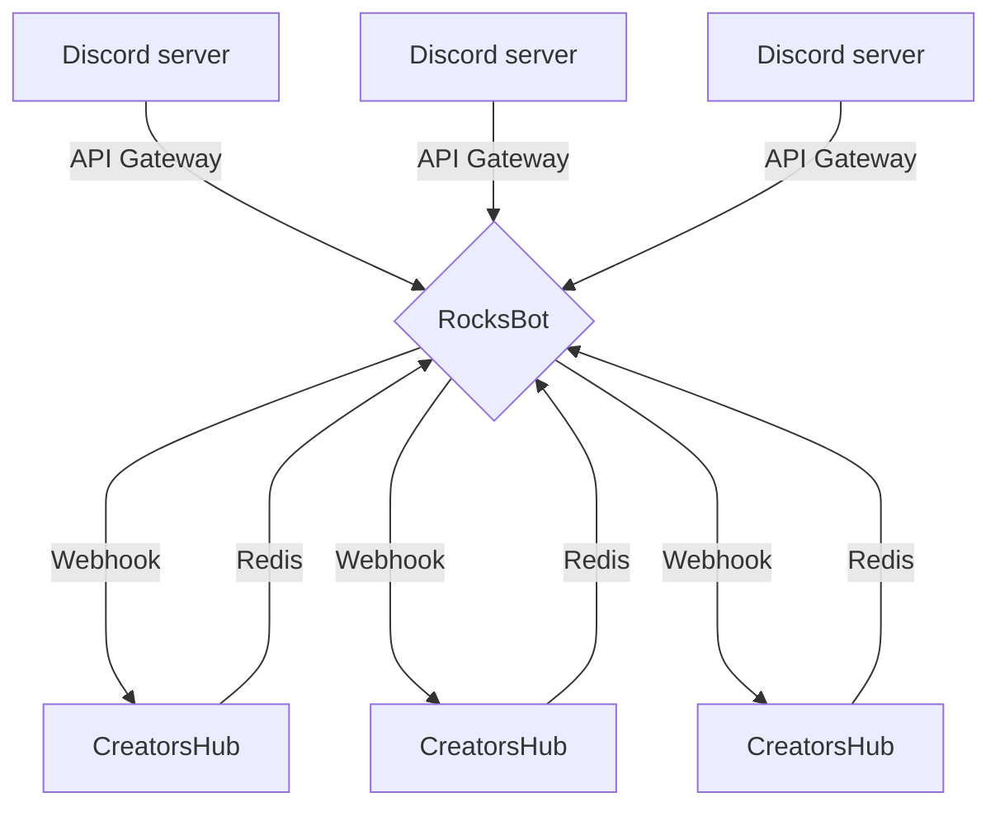

# RocksBot

**RocksBot** is a Discord Bot that acts as an integration layer between Discord chat platform and **CreatorsHub** instances at **License.rocks GmbH**. It is primarly used for Discord campaigns and rewarding NFT owners with specific Discord roles.

It does not require any database _(has no any state persist mechanism)_ to work and relies only on TCP and HTTP communication.

Non-technical documentation _(for users or server admins)_ can be found [on official license.rocks docs](https://docs.license.rocks/rocksbot/)

If you want to create your own bot from scratch, check out our article _"[Discord: Create Bots – How to in a few steps](https://license.rocks/discord-create-bots-how-to-in-a-few-steps)"_

## Features & technologies used

RocksBot:

- 🥷 is created in TypeScript
- talks with [Discord's API][discord-api] using brilliant [discord.js][discord-js] library
- communicates with [Redis][redis] database using powerful & robust [ioredis][ioredis] library
- handles HTTP stuff with help of [axios][axios] client

## Setting up & installation

### Prerequisities

- Node.js (>=16.5)
- npm (>=8.0)
- redis (>=6.5.2)

### Environment variables

Copy `.env.example` file to `.env` and put your values there

| **Environment variable name** | **Description**                                                                                                                  |
| ----------------------------- | -------------------------------------------------------------------------------------------------------------------------------- |
| `DISCORD_TOKEN`               | Token of the Discrod's API bot account. Read more [here](https://discordjs.guide/preparations/setting-up-a-bot-application.html) |
| `DISCORD_CLIENT_ID`           | Client ID of the Discord's API application.                                                                                      |
| `DISCORD_TEST_GUILD_ID`       | Test guild id. Described [here](#bot-development)                                                                                |
| `REDIS_PORT`                  | Port of redis working process                                                                                                    |
| `REDIS_HOST`                  | Host of redis working process                                                                                                    |
| `REDIS_DB_NO`                 | Number that determines which redis database to use                                                                               |

### Starting the bot

- Clone the repository and install dependencies

```sh
git clone https://github.com/LicenseRocks/rocksbot/ && cd rocksbot && npm i
```

- Run in development mode: `npm run dev`
- _... or in production mode: `npm run build && npm run start`_

## Bot commands

Bot application's commands are implemented using marvellous slash commands. When typing them in the chat input it will trigger auto-completion and suggestions along with descriptions which command is responsible for what. Here is some quick presentation of all RocksBot's commands:

| **Command**                                         | **Description**                                                                                                                                                                                                                                                  |
| --------------------------------------------------- | ---------------------------------------------------------------------------------------------------------------------------------------------------------------------------------------------------------------------------------------------------------------- |
| `/verify <creators-hub-url> <creators-hub-secret>`  | Verifies & connects the guild to the **CreatorsHub** instance. Should be used once by server administrator. [more info here...](https://docs.license.rocks/rocksbot/intro/#verifying--connecting)                                                                |
| `/refresh <creators-hub-url> <creators-hub-secret>` | Refreshes server info on specific **CreatorsHub** instance. Server info consists of guild avatar, name, list of available roles and some other things. Should be used by server administrator. [more info here...](https://docs.license.rocks/rocksbot/refresh/) |
| `/info <optional: user mention>`                    | Gets basic information about the user. If no member mention is provided - this command will show info about the one who called it.                                                                                                                               |
| `/emit <event>`                                     | **This command is intended to be used only by developer and does not exist in production build!**. Its purpose are hassle-free mock of Discord's API gateway events such as `guildCreate`                                                                        |

## How does it work under the hood

RocksBot's logic is uncomplicated and relies heavily on info provided via redis messages. The bot subscribes to messages on specific channel and handles them basing on payload, which looks like that:

- NFT purchase reward example:
  ```json
  {
    "type": "nft_purchase_reward",
    "payload": {
      "guildId": "950679058755248164",
      "destinationUserId": "961201518005067800",
      "roleId": "953286333793726544"
    }
  }
  ```
- NFT reward role revoke example:
  ```json
  {
    "type": "nft_reward_revoke",
    "payload": {
      "guildId": "950679058755248168",
      "destinationUserId": "950678424761024552",
      "roleId": "953286333793726544"
    }
  }
  ```

RocksBot does perform only basic validation of provided data. If something goes wrong it is most likelly not related to the bot itself. The messages publisher must be sure that everything is ok since the application is not aware of any extra logic on the publisher's side and **only subscribes to messages and handles them**.

<details>
  <summary>The communication process (click to expand)</summary>



</details>

## Bot development

For development purposes it is good practice to create test Discord server and invite the bot to it. This is necessary when application is running in development mode since command interactions register process works different on each environment _(production, development)_

### Dependency injection

Manual injections _(if any)_ should be first in the constructor, then the auto deducted ones. The manual injections are provided in second parameter of `resolve()`

[discord-api]: https://discord.com/developers/docs/
[discord-js]: https://discord.js.org/
[redis]: https://redis.io/
[ioredis]: https://github.com/luin/ioredis
[axios]: https://github.com/axios/axios
